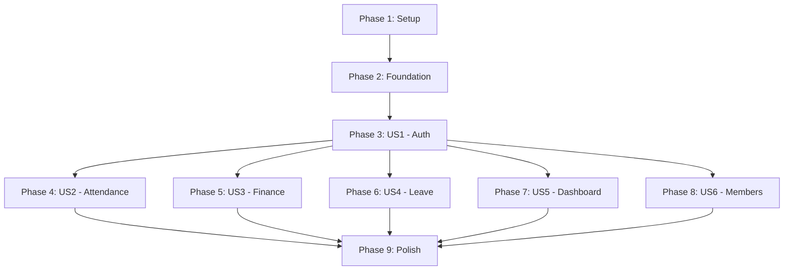

# Tasks: Comprehensive Testing Suite

**Feature**: Comprehensive Testing Suite
**Branch**: `002-comprehensive-testing`

## Implementation Strategy

Chúng ta sẽ triển khai bộ test theo từng User Story (US) ưu tiên từ P1 đến P2. 
Mỗi phase sẽ bắt đầu bằng việc cài đặt/cấu hình cần thiết cho story đó, sau đó viết unit test cho logic (composables) và v-test cho components/views liên quan.
Sử dụng **Mocks** cho Firebase để đảm bảo test chạy nhanh và cô lập.

## Phase 1: Setup

- [ ] T001 Install testing dependencies: `npm install -D vitest @vue/test-utils happy-dom @vitest/coverage-v8`
- [ ] T002 Update `package.json` with test scripts
- [ ] T003 [P] Create Vitest configuration `vitest.config.js`

## Phase 2: Foundational

- [ ] T004 Create global test setup file `tests/setup.js`
- [ ] T005 [P] Create Firebase mock utilities in `tests/mocks/firebase.js`
- [ ] T006 [P] Create Vue Router mock utilities for testing views

## Phase 3: User Story 1 - Xác thực & Phân quyền (P1)

- [ ] T007 [US1] Create unit tests for `src/composables/useAuth.js` in `tests/unit/useAuth.test.js`
- [ ] T008 [P] [US1] Create unit tests for `src/composables/useBreakpoints.js` in `tests/unit/useBreakpoints.test.js`
- [ ] T009 [US1] Implement tests for Role-based access in `tests/unit/useAuth.test.js`

## Phase 4: User Story 2 - Điểm danh trận đấu (P1)

- [ ] T010 [US2] Create unit tests for `src/composables/useQRAttendance.js` in `tests/unit/useQRAttendance.test.js`
- [ ] T011 [P] [US2] Create unit tests for `src/composables/usePenalties.js` in `tests/unit/usePenalties.test.js`
- [ ] T012 [US2] Create component tests for `src/views/AttendanceView.vue` and `src/views/PendingAttendancesView.vue`

## Phase 5: User Story 3 - Quản lý tài chính (P1)

- [ ] T013 [US3] Create unit tests for `src/composables/useFinancialCalculations.js` in `tests/unit/useFinancialCalculations.test.js`
- [ ] T014 [P] [US3] Create unit tests for `src/composables/useMoMo.js` in `tests/unit/useMoMo.test.js`
- [ ] T015 [US3] Create component tests for `src/views/FinanceView.vue` and `src/views/MyPaymentsView.vue`

## Phase 6: User Story 4 - Quản lý nghỉ phép (P2)

- [ ] T016 [US4] Create unit tests for `src/composables/useLeaveRequests.js` in `tests/unit/useLeaveRequests.test.js`
- [ ] T017 [US4] Create component tests for `src/views/LeaveRequestView.vue` and `src/views/LeaveManagementView.vue`

## Phase 7: User Story 5 - Dashboard & Thống kê (P2)

- [ ] T018 [US5] Create unit tests for `src/composables/useAppState.js` in `tests/unit/useAppState.test.js`
- [ ] T019 [US5] Create component tests for `src/views/DashboardView.vue`

## Phase 8: User Story 6 - Quản lý thành viên (P2)

- [ ] T020 [US6] Create component tests for `src/views/MembersView.vue`
- [ ] T021 [P] [US6] Create component tests for `src/components/MemberSelector.vue`

## Phase 9: Polish & Cross-Cutting

- [ ] T022 [P] Create component tests for global layout: `src/components/Sidebar.vue` and `src/components/BottomNav.vue`
- [ ] T023 Run full test suite and ensure 100% pass rate
- [ ] T024 Generate and review coverage report, ensuring P1 stories have >90% coverage

## Dependency Graph

